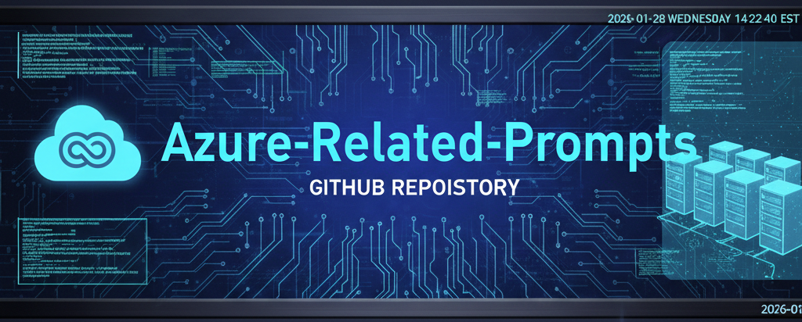

  

<h1 align="center">Azure‑Related Prompt Library</h1>
<h3 align="center">By Scott Malin — Cybersecurity & Automation Architect</h3>

A collection of deterministic, audit‑ready AI prompt frameworks for Azure AD / Entra ID, Conditional Access, and enterprise identity governance.

  
  
  
  

---

# ⭐ Featured Prompt

### **Conditional Access Policy Analyzer (Deep‑Dive Audit).md**  
**Goal:** Perform a structured, evidence‑based audit of Conditional Access policies, including conflicts, gaps, redundancies, and risk‑aligned recommendations.

---

# 📘 Overview

This repository contains **Azure‑focused AI prompt frameworks** designed for:

- Conditional Access design, auditing, and simulation  
- Identity governance and access control modeling  
- Documentation generation for enterprise environments  
- Hardening and risk‑based policy refinement  
- Deterministic, repeatable reasoning for Azure identity workflows  

These prompts support:
- Cloud security engineers  
- IAM architects  
- Identity governance teams  
- Azure administrators  
- Audit and compliance functions  

---

# 📁 Repository Structure & Goals

Below is the full file list with **goal statements** for clarity and governance.

### 🔐 **Conditional Access Design & Architecture**
- **Access Policy Architect — Design Generator.md**  
  *Goal:* Generate structured, risk‑aligned Conditional Access policy designs with justification and architecture notes.

### 📝 **Documentation & Governance**
- **Conditional Access Documentation Generator.md**  
  *Goal:* Produce complete, audit‑ready documentation for existing Conditional Access policies.

### 🛡️ **Hardening & Risk Reduction**
- **Conditional Access Hardening Advisor.md**  
  *Goal:* Identify weaknesses, misconfigurations, and improvement opportunities based on Microsoft best practices.

### 🔍 **Analysis & Deep‑Dive Auditing**
- **Conditional Access Policy Analyzer (Deep-Dive Audit).md**  
  *Goal:* Perform a comprehensive audit of policy interactions, conflicts, gaps, and enforcement logic.

### 🎛️ **Simulation & What‑If Modeling**
- **Conditional Access Policy Simulator.md**  
  *Goal:* Model user, device, and session scenarios to predict Conditional Access outcomes.

### 📄 **Repo Files**
- **LICENSE**  
- **README.md** (this file)

---

# 🕒 Version History / Changelog

### **v1.3 — January 2026**
- Added Cyber Blue banner  
- Unified README structure  
- Added goal statements for all prompts  
- Added featured prompt  
- Standardized cross‑repo navigation  
- Updated file list and categories  

---

# 🔗 Cross‑Repo Navigation

- 🛡️ **Cybersecurity Prompts**  
  https://github.com/scottmalin68-commits/Cybersecurity-Prompts  

- 🧰 **PowerShell Security & Automation Toolkit**  
  https://github.com/scottmalin68-commits/Powershell_Scripts  

- 🧩 **Misc AI Prompt Library**  
  https://github.com/scottmalin68-commits/Misc-AI-Prompts  

- 🎮 **Cybersecurity Learning Prompts**  
  https://github.com/scottmalin68-commits/Cybersecurity-Learning-Prompts  

- 🧭 **GitHub Profile**  
  https://github.com/scottmalin68-commits  

---

# 📜 License  
MIT License — see `LICENSE` for details.
